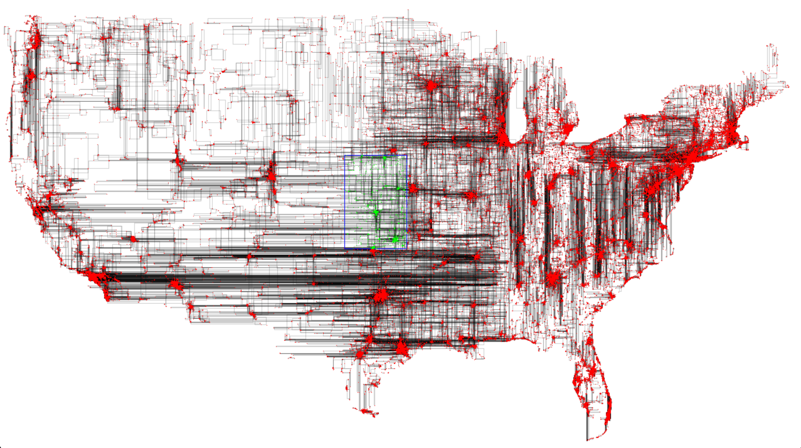

# TIPE

Sources en C++ de mon TIPE d'informatique où j'implémente la structure de [R-Arbre](https://fr.wikipedia.org/wiki/R-arbre) [1].

Voir la [MCOT](assets/mcot.pdf) pour une bref explication de ce que sont les R-Arbres.

  
    <em>Un R-Arbre contenant 6 000 points, M=7.</em>

####

  
    <em>500 000 restaurants américains indexés, en bleu la fenêtre de recherche, M=7.</em>

## TODO:

- Hilbert R-Tree
- R*-Tree

## Références

[1] ANTONIN GUTTMAN : R-trees : a dynamic index structure for spatial searching :
Proceedings of the 1984 ACM SIGMOD international conference on Management of data,
(1984), New York, New York